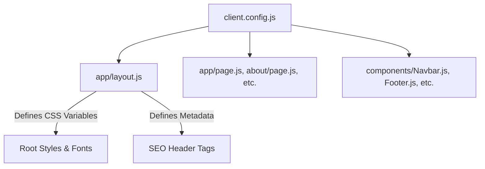

# Technical Architecture: How the Application Works

This document details the software architecture, coding patterns, data flow, styling mechanism, and third-party integrations of the Next.js landing page template.

---

## 1. Technical Core Stack

The project is built on:
*   **Next.js 16.2.6 (App Router)**: Utilizing React 19 and Node-based build scripts.
*   **React 19.2.4**: Built with functional components and React hooks (e.g., `useState` in forms and menus).
*   **CSS Custom Properties (Variables)**: Configures global style tokens.
*   **Tailwind CSS v4**: Installed in `package.json` for optional utility-class usage, though components are currently styled using standard scoped vanilla CSS blocks.

---

## 2. Dynamic Configuration Pattern

This template is designed to separate **code** from **content**. 



Every page and UI component imports the central object:
```javascript
import clientConfig from "@/client.config";
```
When updates are made to `client.config.js`, Next.js Fast Refresh automatically updates the browser instantly in development, and the static builder renders them automatically for production.

---

## 3. Styling and Custom Theme Generation

The app generates a custom CSS theme based on parameters in `brand` config.

### A. Root Injection (`app/layout.js`)
Inside [`app/layout.js`](file:///c:/Users/Abdul/Downloads/business-template/business-template/app/layout.js), variables are defined inside a standard JSX `<style>` tag:

```javascript
:root {
  --primary:         ${brand.primaryColor};
  --secondary:       ${brand.secondaryColor};
  --text-on-primary: ${brand.textOnPrimary};
  --light-bg:        ${brand.lightBg};
  --dark-bg:         ${brand.darkBg};
  --body-text:       ${brand.bodyText};
  --font:            '${brand.fontFamily}', sans-serif;
}
```

### B. Font Loading
The system dynamically replaces spaces in `brand.fontFamily` with `+` and creates a pre-connect Google Fonts link:
```html
<link href={`https://fonts.googleapis.com/css2?family=${fontName}:wght@300;400;500;600;700;800&display=swap`} rel="stylesheet" />
```

### C. Component Styles
Each file (e.g., [`components/Navbar.js`](file:///c:/Users/Abdul/Downloads/business-template/business-template/components/Navbar.js) or [`app/page.js`](file:///c:/Users/Abdul/Downloads/business-template/business-template/app/page.js)) uses inline `<style>` tags with standard vanilla CSS rules. These styles utilize the `--primary`, `--secondary`, and `--font` variables. This structure makes it easy to write clean CSS for each layout page without adding third-party styles.

---

## 4. Routing and Page Toggle Mechanism

All pages (`/`, `/about`, `/services`, `/gallery`, `/contact`) exist as physical routes. However, visibility is controlled dynamically:

1.  **Navbar Filter (`components/Navbar.js`)**:
    An array of pages is filtered based on the boolean settings in `client.config.js`:
    ```javascript
    const navLinks = [
      { label: "Home",     href: "/",         show: pages.home },
      { label: "About",    href: "/about",    show: pages.about },
      { label: "Services", href: "/services", show: pages.services },
      { label: "Gallery",  href: "/gallery",  show: pages.gallery },
      { label: "Contact",  href: "/contact",  show: pages.contact },
    ].filter((l) => l.show);
    ```
2.  **Footer Filter (`components/Footer.js`)**:
    Similarly checks boolean status using logical AND operators:
    ```javascript
    {pages.about && <li><Link href="/about">About</Link></li>}
    ```

> [!NOTE]
> Even if a page is set to `false`, the route remains accessible if typed directly in the URL bar. The toggle controls *navigation visibility*. If a client explicitly does not want a section, toggle it off in the navbar, and optionally place a redirect or leave it blank.

---

## 5. Integrations & Client Communication Channels

The application incorporates three mechanisms to connect visitors with the business:

### A. WhatsApp Direct Call-to-Action
*   **Implementation**: Utilizes the WhatsApp Click-to-Chat protocol (`https://wa.me/`).
*   **Format**: The phone number must be configured in full international format **without** symbols, spaces, or a leading zero (e.g. `27710000000` for a South African number `071 000 0000`).
*   **Message Pre-Fill**: Forms a URL encoded string so that clicking any CTA button loads a template message in the user's WhatsApp client:
    ```javascript
    const whatsappLink = `https://wa.me/${business.whatsappNumber}?text=Hi%2C%20I%27d%20like%20a%20quote.`;
    ```

### B. Formspree Contact Form
*   **File Location**: [`app/contact/page.js`](file:///c:/Users/Abdul/Downloads/business-template/business-template/app/contact/page.js)
*   **Workflow**:
    1. Visitors enter Name, Phone/WhatsApp, Email, and Message.
    2. JavaScript intercepts the form submit using `e.preventDefault()`.
    3. An asynchronous JSON fetch POST request is sent to `https://formspree.io/f/${contact.formspreeId}`.
    4. Upon a successful response, a React local state variable `submitted` is set to `true`, displaying a clean checklist success screen.
    5. Fallback alerts prompt visitors to use the WhatsApp channel directly if a network error occurs.

### C. Google Map Embed
*   **Implementation**: An `iframe` component inside [`app/contact/page.js`](file:///c:/Users/Abdul/Downloads/business-template/business-template/app/contact/page.js) loads a Google Maps embed URL dynamically:
    ```html
    <iframe src={contact.mapEmbedUrl} ... />
    ```
*   **Configuration**: To change it, paste the URL embedded inside Google Maps' standard generated HTML `src="..."` property.
